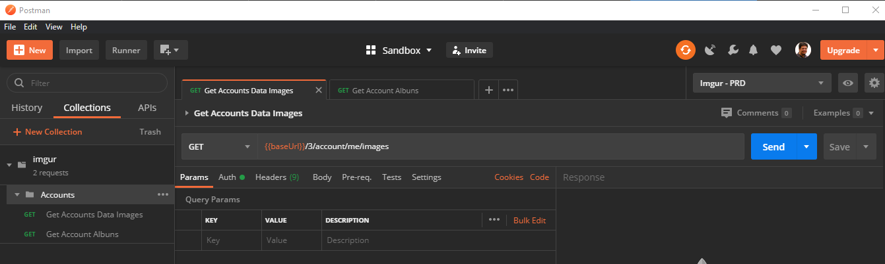
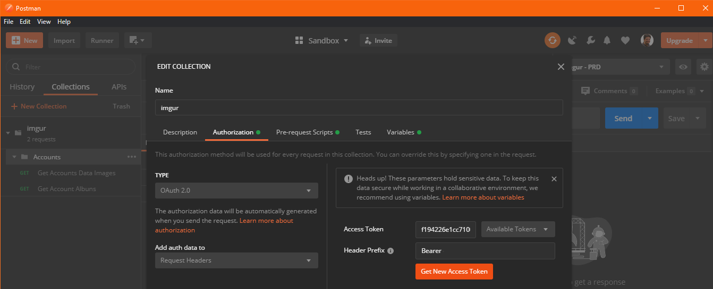
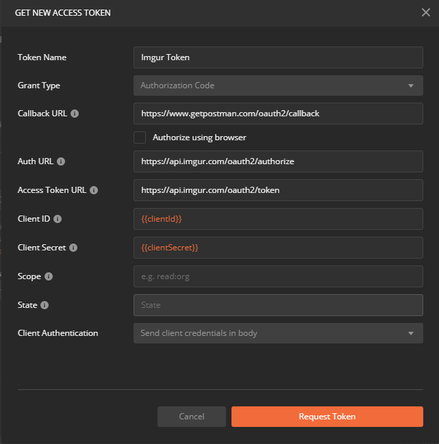
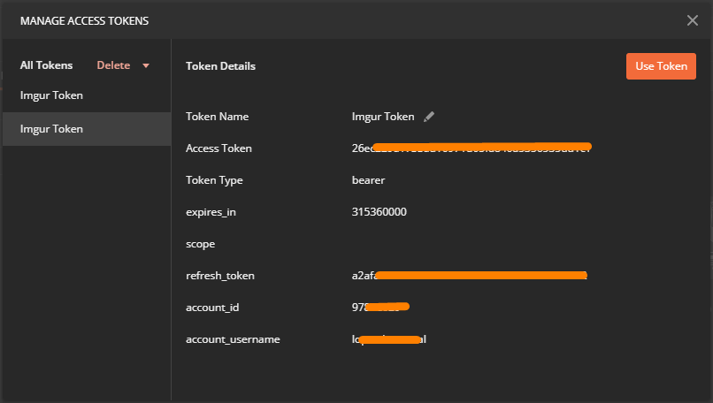
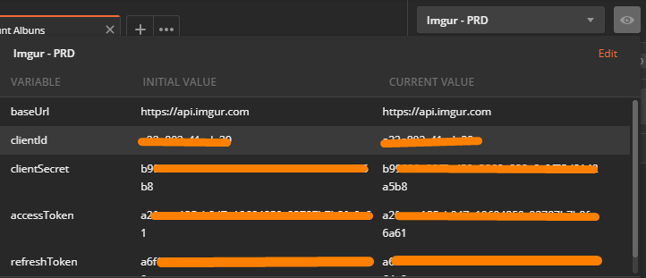

# postman-imgur
Using Postman with Oauth2 and refreshing its token automatically using pre-request scripts


## Step-by-Step

### Collection creation

I created a collection `imgur` and a folder `Accounts` under it to put all account related endpoints. It should look like this

 

### Environment variables
- `baseUrl`: https://api.imgur.com
- `clientId` and `clientSecret`: obtained when you subscribe your app at imgur service
- `accessToken` and `refreshToken`: used to store its respectives values when we get it

### Oauth2 authentication
In this solution, I'll need to get manually the first pair of access and refresh token. After that, I'll refresh automatically when access token expires.

Right clicking at the collection, go to Edit at the context menu, and then to the Authentication tab.



Select `Oauth 2.0` as the type of authentication. After that, click on `Get New Access Token` to setup all info, then `Request Token`:

```
Callback URL: https://www.getpostman.com/oauth2/callback
Auth URL: https://api.imgur.com/oauth2/authorize
Access Token URL: https://api.imgur.com/oauth2/authorize
```



At this moment, you're going to be requested to loggin to imgur and if everythig is ok, you're going to get a Token ready to be used.



> Note: all requests that need to authenticate, could use `Inherit auth from parent` at its Auth tab. Although, for our purpose, choose the `Bearer Token` option, and fill the Token field with the Enviroment variable `{{accseeToken}}`. This way, every time we change the variable value, the token will be changed in every request.

> Note 2: Either choosing `Inherit auth from parent` or `Bearer Token` an `Authorization` entry will be added to request Header automatically.

### Using the first gotten token
After configuring and getting correctly the first pair of tokens, copy and paste its values to its respectives environment variables.



Try to run some simple request to see if your basic setup is functioning

To be continued...

## References

- [Imgur apiDocs](https://apidocs.imgur.com/)
- [How to Automate OAuth2 Token Renewal in Postman](https://medium.com/@allen.helton/how-to-automate-oauth2-token-renewal-in-postman-864420d381a0)
- [Postman Sandbox API reference](https://learning.postman.com/docs/postman/scripts/postman-sandbox-api-reference/#pmsendrequest)
- [How to persist an OAuth2 token (or use a refresh token) in Postman collections?](https://stackoverflow.com/questions/35070891/how-to-persist-an-oauth2-token-or-use-a-refresh-token-in-postman-collections)
- [Dynamic variables in Postman](https://learning.postman.com/docs/writing-scripts/script-references/variables-list/)
- [Dynamic variables](https://postman-quick-reference-guide.readthedocs.io/en/latest/dynamic-variables.html)
